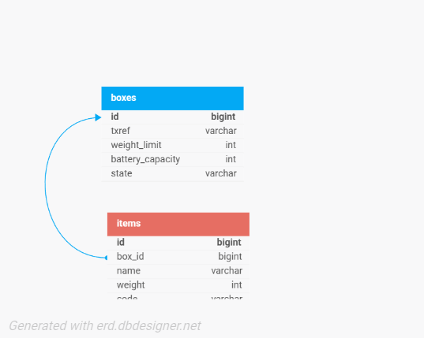

# Box Service (Spring Boot)

REST API for managing delivery boxes and loading items, with business rules:
- A box cannot be loaded above its `weightLimit` (max 500g).
- A box cannot be loaded when `batteryCapacity` is below 25%.

## Tech
- Java 25 + Spring Boot (Maven)
- Spring WebMVC + Validation + Spring Data JPA
- H2 in-memory database (with seed data)
- Postman (for api testing)

## Run

From `Box/box`:

```powershell
.\mvnw.cmd spring-boot:run
```

App starts on `http://localhost:8080`.


Root health/info endpoint:
- `GET /` returns a small JSON payload showing the service is running and listing key endpoints.

H2 console is enabled at `http://localhost:<PORT>/h2-console` and uses:
- JDBC URL: `jdbc:h2:mem:boxdb`
- user: `sa`
- password: empty

## Test

```powershell
.\mvnw.cmd test
```

## Test Results

- `BUILD SUCCESS`
- `Tests run: 3, Failures: 0, Errors: 0, Skipped: 0`

## API

### Create a box
`POST /api/boxes`

```json
{
  "txref": "TXREF_12345678901234",
  "weightLimit": 500,
  "batteryCapacity": 90
}
```

### Load items into a box
`POST /api/boxes/{boxId}/load`

```json
{
  "items": [
    { "name": "item-1", "weight": 100, "code": "ITEM_1" }
  ]
}
```

### Get loaded items
`GET /api/boxes/{boxId}/items`

### Get available boxes for loading
`GET /api/boxes/available`

### Get battery level
`GET /api/boxes/{boxId}/battery`

## ER Diagram



## Postman Testing

Base URL:
- `http://localhost:8080`

For JSON requests, set header:
- `Content-Type: application/json`

1. Create box (valid)
- `POST /api/boxes`
```json
{ "txref": "TXREF_12345678901234", "weightLimit": 500, "batteryCapacity": 90 }
```
Expected: `201` and a JSON response containing `id`. Use that `id` below.

2. Load items (valid)
- `POST /api/boxes/{id}/load`
```json
{
  "items": [
    { "name": "item-1", "weight": 100, "code": "ITEM_1" },
    { "name": "item_2", "weight": 50, "code": "ITEM_2" }
  ]
}
```
Expected: `200` and `state` becomes `LOADED`.

3. Get loaded items
- `GET /api/boxes/{id}/items`
Expected: `200` list of items.

4. Get available boxes
- `GET /api/boxes/available`
Expected: `200` list.

5. Get battery level
- `GET /api/boxes/{id}/battery`
Expected: `200` with current battery percentage.

### Negative Tests (Rules)

6. txref too long (validation)
- `POST /api/boxes`
- Use a `txref` longer than 20 characters
Expected: `400` with `violations` mentioning `txref`.

7. battery below 25% (business rule)
- Create a box with `"batteryCapacity": 20`, then try to load items
Expected: `400`.

8. overweight load (business rule)
- Create a box with `"weightLimit": 100`, then try to load items totaling `> 100`
Expected: `400`.

9. invalid item code format (validation)
- Load items with `"code": "item_1"` (lowercase)
Expected: `400` with `violations` mentioning `code`.

## Assumptions
- A `Box` can contain many `Item`s.
- "Available for loading" is interpreted as: `state == IDLE` and `batteryCapacity >= 25`.
- Loading sets state to `LOADING` during the operation and ends at `LOADED` when items are saved.
